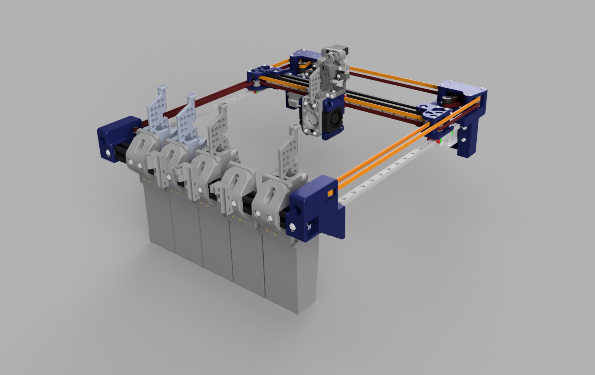
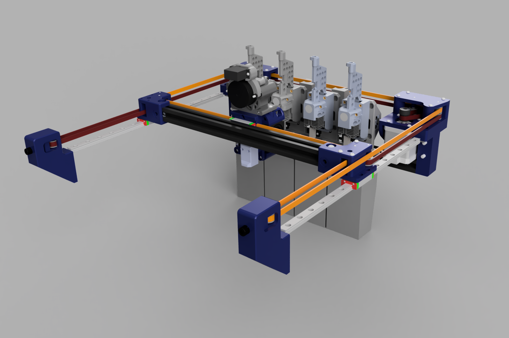

# MedusaHC V0.2 (Beta)






MedusaHC is an open-source toolchanger (hotend-changer) project.
This is a beta version of the project. It is not finished yet, and there may be bugs during operation. The project will be updated gradually.

> [!IMPORTANT]
> **[Installation, update, removal, and manual setup instructions](INSTALLATION.md)**

This project is licensed under GNU GPLv3.
You're free to use, modify, and share it — just keep the copyright/license notices intact, provide the source code, release derivatives under GPLv3 too, and note what you changed.

For the exact terms, see the LICENSE file.

## Support the project

If you have the ability and desire to support the project, you can do it in several ways:

https://irbis3d.xyz/

- Patreon — monthly support: https://patreon.com/Irbis3D
- Ko-fi / Buy Me a Coffee — one-time donations: https://buymeacoffee.com/Irbis3D
- YouTube Super Thanks — under any video: https://youtube.com/@Irbis3D

Your support helps me create more content, upgrade gear, and keep experimenting with cool ideas.

Also, by buying parts using my links, you help as well.

## Software options

> [!IMPORTANT]
> The `main` branch now uses the Python-based tool-change controller. It has
> completed extended testing on the development printer, has proven reliable,
> and is the strongly recommended implementation for new and existing
> installations. Current optional MedusaHC modules are developed against it.

The controller keeps the familiar MedusaHC commands and configuration
structure while moving pickup, parking, feeder, priming, cleaning, and sensor
verification into the Klipper Python module `medusahc.py`. This avoids the
chained execution and unnecessary fixed waits of the original macro controller.

The final working macro-based implementation is preserved in the frozen
[`legacy-macros`](https://github.com/Irbis3D/MedusaHC/tree/legacy-macros)
branch. It retains the old klipper-toolchanger calibration workflow and is
provided for compatibility and rollback, but new functionality is not planned
for that branch. Migration to the Python controller is strongly recommended.

The optional [MedusaHC Control](https://github.com/Irbis3D/MedusaHC-Control)
panel is installed independently. Its current transitional release supports
the Python controller and the preserved legacy macro names.

Optional features are kept in separate projects so they can be installed and
updated independently:

- [MedusaHC-Calibrate](https://github.com/Irbis3D/MedusaHC-Calibrate) — automatic
  tool-offset calibration using a contact sensor, native Eddy Tap, or Eddy Tap
  together with a stationary Eddy Coil and EddySeek;
- [MedusaHC-Mainsail](https://github.com/Irbis3D/MedusaHC-Mainsail) — experimental
  Mainsail integration for the MedusaHC Control panel.

The base MedusaHC configuration does not require either optional module.

## Credits

This project uses some work and ideas from the Dragonburner project by chirpy2605:
https://github.com/chirpy2605/voron/tree/main/V0/Dragon_Burner

As well as from Sherpa_mini-Extruder by Annex-Engineering
https://github.com/Annex-Engineering/Sherpa_Mini-Extruder

The alternative V-Front mounts with a profile opening were contributed by **GN500**. GN500 has also published an MGN12H version on Printables.

## Current status and compatibility

Right now, MedusaHC is an add-on for my Duender project:
https://www.printables.com/model/1798903-duender-project-ender-3-to-corexy-conversion
https://github.com/Irbis3D/Duender

V0.2 supports two basic dock layouts:

- **V-Front** — the hotend bases are installed in front of the print area. This layout can accommodate more tools and may be more convenient when adapting MedusaHC to other CoreXY printers, including Voron-style machines.
- **V-Back** — the hotend bases are installed behind the print area, closer to the XY motors. The shorter effective belt path between the drive and the dock area reduces the influence of belt elasticity during tool changes and can improve docking repeatability. It also keeps the front of the printer unobstructed and the print area easy to see.

The supplied STEP assembly is a visual and mechanical reference. It demonstrates that up to **5 tools** can fit in the V-Front layout and shows a **4-tool** V-Back arrangement. The supplied configuration and OrcaSlicer profile are intentionally set up for **4 tools**.

The project can potentially be adapted for other classic CoreXY printers and, with suitable mounting changes, for CoreXY machines with a flying gantry. Available space, axis travel, dock coordinates, parking positions, wiring, and controller capacity must be checked for every printer.

The point of the project is that, unlike classic toolchangers, MedusaHC swaps only the hotend as a tool (with heater, thermistor, and fan). I am not the first who did this and I will not be the last. This topic is actively discussed and developed on my
Discord server - https://discord.gg/ae44FHv786

## What is new in V0.2

- V-Front and V-Back dock layouts use the same Python tool-change controller.
- `variable_tools_direction` automatically reverses layout-dependent pickup, drop, cleaning, and priming movements.
- The supplied configuration uses four tools numbered normally from `T0` to `T3`.
- The base, nozzle-cleaning, PTFE-cleaning, priming, and wire-management parts have been updated.
- Native Klipper Eddy tap replaces Eddy-ng for Z probing.
- Automatic tool-offset calibration is available separately through
  MedusaHC-Calibrate and does not require klipper-toolchanger.
- Updated OrcaSlicer projects, a 4-tool printer preset, and post-processing scripts are included.
- Camera-assisted tool calibration is not currently supported. A new native or
  adapted camera module may be developed later.

See [CHANGELOG.md](CHANGELOG.md) for the complete V0.2 release notes.

## Documentation and audience

For a general understanding, I recommend watching the first video about this project on my YouTube channel. You will not find all the information there, but you can get a general idea of how it works.

[](https://www.youtube.com/watch?v=hpV5Z1TnGdY)

Recently a video about the hardware part of MedusaHC was released on the channel. In the next video I will explain the software side — configuration, macros, and how everything is set up.

[](https://www.youtube.com/watch?v=F2OpeA6CTm0)

But the main thing is that, thanks to the huge effort of **TallothEndill**, a detailed text manual is already in progress and largely covers the project. It is not fully finished yet, but it is already very useful as a reference:

[MedusaHC manual (work in progress)](https://drive.google.com/file/d/1KkSGdeQZzl4gnCMKlBloHfCNIlD4JwAP/view)


## Parts, BOM, and files

Link to BOM

https://docs.google.com/spreadsheets/d/1xkOzb10DBJzalW4n1tYroh-m_ZFsTQipC1BpUh5ZMWY/edit?gid=1290815756#gid=1290815756

For this project you need to buy quite a lot of parts. I tried not to use expensive and rare components. You can find the list at the link above. This file will be updated as the project updates.

The full STEP file contains both V-Front and V-Back reference assemblies. It is primarily intended to show the construction, available space, and the relationship between the parts. It is not a promise that the example tool count matches the supplied 4-tool configuration. The file was created in Fusion 360; FreeCAD may have problems opening it because of STEP compatibility differences.

Printable STL files are organized by subsystem. The layout-specific mounting parts are separated into `V-Front Mounts` and `V-Back Mounts` folders. Common base, feeder, hotend, and toolhead parts are stored in their own folders.

The OrcaSlicer 3MF projects and the 4-tool printer preset are located in the `Slicer` folder. They show the printer configuration and a multicolor test project. Post-processing paths are computer-specific and must be configured by the user.

To understand how the system is assembled, use the STEP file together with the STL folder descriptions. I printed the functional parts in ABS with 98% infill.

### Duender XY mounting compatibility

The layout-specific mounts supplied in this V0.2 package are designed for a **Duender with MGN9H rails on the XY axes**.

An MGN12H installation requires the MedusaHC mounting system to be raised slightly to compensate for the different rail and carriage geometry. The required correction depends on the selected Duender parts and must be checked during assembly.

#### V-Front installation

There are two mounting options for a front installation:

1. Keep the standard Duender front XY mounts and glue the included `Base_Profile_Mount_L.stl` and `Base_Profile_Mount_R.stl` adapters to them. The adapters are located in `STLs/V-Front Mounts`.
2. Replace the standard front mounts with the V-Front mounts contributed by GN500. These mounts include an opening for the front profile. The MGN9H versions are included in this package; an MGN12H version is available from GN500 on Printables.

No other Duender kinematic changes are required for the V-Front installation. The X rail and belt path remain in their normal orientation.

#### V-Back installation

For a rear installation, the standard Duender front mounts remain installed. The MedusaHC docks are attached to the rear profile using the new V-Back mounting parts.

Because all tools are behind the X axis, the complete X axis must be turned toward the rear:

- install the new reversed left and right X-axis mounts;
- move the X linear rail to the opposite side of the profile;
- route the belts behind the X profile;
- check the complete belt path and all moving clearances before homing.

At the toolhead belt clamp, several belt teeth must currently be removed from the clamped section so the carriage can seat fully. A small drop of cyanoacrylate adhesive can be used to reduce the risk of belt slippage. This is a temporary assembly solution and may be redesigned later.

Depending on the printer geometry and the required rear clearance, the complete Z axis together with the bed may also need to be shifted forward.

## Important notes

All parts must be printed with good enough quality so that parts do not get stuck inside each other. Some contact surfaces may need a bit of sanding to make them smooth.

When installing magnets (I glued them, and all magnet holes have access from the back for removing magnets), be careful and do not mix up the polarity.

The M3 pins that act as hotend guide pins must be pressed into the plastic as straight as possible. I hammered them in, but it is better to do it carefully using a vise. The two lower M3 30mm pins are mandatory. The upper M3 20mm pins are optional, if the hotend does not hold firmly enough.

On the hotend, the matching holes for the pins must be prepared. Personally, I used M3 inserts for this, and I drilled them first with a 3mm bit (they are usually about 2.9mm), and then with a 3.2mm bit (my bits are closer to 3.1mm). Even though the size looks odd, these drill bits are quite common.

Before drilling the actual part, I recommend testing on some test piece to make sure the hole is not too large. The pins must slide in freely, but must not be loose.

Maybe later it will be possible to use brass bushings of the correct diameter, but they take more space and may not fit.

The pressure lever spring for the feeder from the standard Sherpa Mini kit does not fit. I just found a suitable spring in my spare parts. When a spring with known dimensions is selected, I will add this information to the BOM.

The spring for the feeder opener lever is just a regular spring from a ballpoint pen.

Other than that, you just need to assemble everything carefully so nothing is loose and nothing binds. As I said earlier, I will explain more nuances in the video.

## Electronics

For this project, I use the **BTT Manta M8P** board. For a 4-hotend configuration, it can be considered the most optimal option. It has enough ports for absolutely everything, including 4 hotend heaters and even a dedicated Servo port (which is sufficient without a DC-DC converter). My configuration files are set up specifically for this board with a **CB2** module.
https://s.click.aliexpress.com/e/_oktZaKt

Roughly the same capabilities are provided by boards like **BTT Octopus Pro**, **Kraken**, and other “large” boards, with the main difference being that the HOST is located separately.
https://s.click.aliexpress.com/e/_c2wuASWJ
https://s.click.aliexpress.com/e/_c3kPDyx1

When using other boards, it is possible to connect additional boards to a single host.

### Ports required per hotend (on the controller board)

For each hotend, the board must have the following ports:

- heater port (MOSFET-controlled; can be used either hotend heaters or the bed)
- thermistor port
- fan port (either PWM-controlled or a constant 24V port)
- endstop port for the endstop located on the base of that hotend

### Ports required for the toolhead

- one extruder motor port
- part cooling fan port(s)
- toolhead endstop port
- port for the auto-calibration sensor (I use **BTT Eddy** connected via CAN)
- servo port — if the board does not have a dedicated servo port capable of supplying stable 5V under load, it is recommended to power the servo via a **24V→5V DC-DC converter** from the main power supply

### Power considerations

Additional hotends require additional power from the PSU.

From experience, a standard **350W** power supply is reliably sufficient for **2 hotends**.
For **3 hotends**, it can be enough with a high-quality PSU.
For **4 hotends**, it is definitely not enough.

In my setup with the **Manta M8P**, I use one **350W** power supply for the heated bed, and another **350W** power supply for everything else.

## Configuration setup

The main printer parameters, as before, are located in the `printer.cfg` file.
In general, the configuration is no different from a standard Duender config.

The exception is that the extruder configuration block has been moved into the MedusaHC configuration file. More on this below.

### Additional modules

Personally, I use **klipper-tmc-autotune** for tuning motor drivers.
(This is optional.)

### Display and sensors

In my opinion, the optimal screen is **BTT HDMI5**.

https://s.click.aliexpress.com/e/_c4odBUeJ

I use **BTT Eddy** connected through CAN. V0.2 no longer uses Eddy-ng or a modified `probe_eddy_ng.py` file. Eddy tap probing is handled by current Klipper functionality.

Native Eddy Tap can be used by the optional MedusaHC-Calibrate module to
measure the Z relationship between tools. Full X/Y/Z calibration can use a
SexBall-style contact sensor or combine Eddy Tap for Z with a stationary Eddy
Coil and EddySeek for XY.

## Arcs support

The `[gcode_arcs]` block and the **Arc fitting** setting in the slicer allow the slicer to use **G2** and **G3** commands to print arcs instead of short straight segments.

On weak HOST systems, problems were observed with this feature. In such cases, it should either be disabled or the resolution should be set higher than **0.1**.

## System configuration files modified for this setup

### sensorless.cfg

This file has been modified quite heavily to make sensorless homing safer and to improve repeatability without physical XY endstops.

The safe parking and homing side depends on the dock layout:

- with **V-Front**, park away from the docks, toward the rear of the printer;
- with **V-Back**, park away from the docks, toward the front of the printer.

The exact coordinates depend on the printer. Check the homing sequence and every parking move before testing at normal speed. Parking positions used by `END_PRINT`, `PAUSE`, `RESUME`, `CANCEL_PRINT`, calibration macros, and service macros must also be adjusted for the selected layout.

The supplied Duender 4-tool configuration uses front docks and rear parking.

### line_purge.cfg

Modified so that the purge line is printed not along the X axis, but on the left side of the bed along the Y axis.

In my setup, **Adaptive** is disabled, so the line is always printed in the same place. It can be enabled if desired, in which case the line will be printed closer to the model.
(Optional.)

### klipperScreen.conf

KlipperScreen support is optional. A custom menu can be created for the main MedusaHC macros, but `KlipperScreen.conf` is not included in this V0.2 folder.

### Camera calibration

Camera-assisted tool calibration is not currently supported. The previous
experimental example was not compatible with the current configuration and
has been removed. A new native implementation or an integration with another
project may be added later.

### macros.cfg

The `START_PRINT`, `END_PRINT`, `PAUSE`, and `RESUME` macros were heavily modified.

The start macro receives from the slicer the required temperatures for the hotends that will be used during the print and heats them up. At the moment, it does not take into account whether a hotend will be used soon or should wait its turn. I am not happy with this behavior yet, but I have not found a good solution so far.

The pause and resume macros are also heavily adapted for this system. The idea is that during tool changes, the printer remembers which tool it is trying to pick up. In case of a failure, the printer pauses and gives time to fix the issue.

It is enough to manually adjust the hotends so that they are in one of the “correct states” and then press resume. Regardless of what was done manually, the printer will automatically check which hotend it planned to take before the pause, park the X and Y axes (this is necessary if the motors skipped steps), and then ensure that the print continues with the correct hotend.

This procedure still has some shortcomings. A visible defect may remain on the model at that spot. Additionally, when parking with sensorless homing, the zero point may shift slightly, which can appear on the model as a small layer shift. In most cases, this shift is very small.

---

## MedusaHC configuration

### Semi-manual Core installation

The Core installer copies the Python controller and `pin_watch.py`, then creates
a separate editable example configuration under
`~/printer_data/config/MedusaHC/`. It does not edit `printer.cfg`, restart
Klipper, or overwrite an existing configuration directory.

```bash
bash -c "$(curl -fsSL https://raw.githubusercontent.com/Irbis3D/MedusaHC/main/install-online.sh)"
```

The supplied example targets a four-tool V-Front Duender with a BTT Manta M8P
V2.0. Its `MHC_config.cfg` contains a complete `[extruder]` definition, so
review and remove conflicting sections from the existing printer configuration
before manually adding:

```ini
[include MedusaHC/MHC_config.cfg]
```

See **[INSTALLATION.md](INSTALLATION.md)** for update, status, safe removal,
complete removal, path overrides, exact installer behavior, and manual
installation instructions. Core configuration migration and automatic printer
setup are intentionally not implemented yet.

The main files responsible for MedusaHC operation are:

- `MHC_config` — configuration of all hardware related to MHC
- `MHC_variables` — variables for configuring various coordinates, speeds, and similar parameters
- `MHC_macros` — the main file containing all macros responsible for MHC functionality

And the `pin_watch.py` script — in the current version, a dedicated script is used to monitor sensor states. It listens to the sensors in real time and updates variable states accordingly. Based on this data, MHC determines what is installed where and checks for errors.

The file must be uploaded via FTP to the folder:

```

/home/biqu/klipper/klippy/extras

```

(` /home/pi/klipper/klippy/extras ` for Raspberry Pi users)

The script was integrated recently and has not been tested on different systems yet. If problems appear, I will make an additional version that works purely on macros, with manual state updates via a macro. (Feedback is required.)

All (or at least almost all) macros are designed to be universal and work with any number of hotends. The number of hotends is defined in the configuration and variables. My current config is for **4 hotends** (higher counts have not been tested yet).

## MHC setup

### MHC_config file

#### [pin_watch io] block

This block configures the `pin_watch` script.

- `sync_toolchanger: 0` — optional compatibility synchronization with
  klipper-toolchanger. It is disabled by default and is not required by
  MedusaHC or MedusaHC-Calibrate. Enable it only after installing and minimally
  configuring klipper-toolchanger separately.
- `sync_mainsail_tools: 1` — highlights the active tool button in the Mainsail/Fluidd tools panel. When a tool is successfully picked up, the corresponding `T<N>` button gets `variable_active = 1`, others get `0`.
- `sync_mainsail_sensors: 1` — turns each tool's button into a state indicator lamp via `variable_color`. The active tool is shown in blue, parked tools (endstop pressed) in green, missing tools (endstop released) in red. The lamp is updated immediately from pin edges, so anomalies are visible in real time.
- `color_active`, `color_pressed`, `color_released` — hex colors (without `#`) used by the indicator lamp. Defaults: blue / green / red.
- `verbose` — enables additional console output with detailed pin state information.
- `pin_e` — microswitch pin located on the toolhead.
- `pin_t0`, `pin_t1`, etc. — microswitch pins on the bases of the corresponding hotends.

Each sync feature is independent. Enable only the integrations you actually
use.

#### [duplicate_pin_override]

Since a single extruder motor is used for all tools, this block must specify the **step**, **dir**, and **enable** pins for that motor. This allows all extruders to use the same pins without causing configuration errors.

#### [extruder], [extruder1], etc.

Nothing special here. All extruders share the same **step**, **dir**, and **enable** pins. The rest is standard extruder configuration.
A corresponding `extruder` block must be created for each hotend.

#### [gcode_macro T0], [gcode_macro T1], etc.

Mandatory macros that “create” additional tools in the system.
The number of these macros must match the number of hotends.

Each `T<N>` macro must declare two variables: `variable_active: 0` and `variable_color: ""`.
These are required by Mainsail/Fluidd to render the tools panel and to receive runtime updates from `pin_watch` when `sync_mainsail_tools` or `sync_mainsail_sensors` is enabled.

#### [servo my_servo]

The last mandatory block. This defines the servo used to help open the feeder.

After that come optional parameters:

- fan configuration (if you are using controllable fan ports)
- additional heater parameters

It is recommended to change heater-related parameters only if there are heating problems, and only as a last resort, preferably temporarily.

---

### MHC_variables file

#### [save_variables]

This block defines the file where tool offsets are stored so they can be restored after a restart.
(It is required when using auto-calibration.)

#### [gcode_macro _TOOL_CFG]

This macro contains the main coordinates and distances used in the system, as well as the speeds and accelerations for the tool change procedure.

- `variable_tools_direction` — selects the dock orientation:
  - `1` for **V-Front**;
  - `-1` for **V-Back**.

  This value automatically reverses the required pickup, drop, cleaning, and priming movements. Do not manually invert the individual movements in `MHC_macros.cfg`.

- `variable_x_t0`, `variable_x_t1`, etc. — the **X coordinate** where each hotend is mounted on its base.
  Enter the real printer coordinates and keep the tools numbered normally from `T0` upward. The supplied Duender configuration uses **65 mm** spacing. The minimum safe spacing depends on the printed parts, hotends, wiring, and available travel.

- `variable_y_safe` — the **Y coordinate** where the extruder with an inserted hotend can freely move left and right without hitting other hotends on their bases.
  For V-Front this is normally in front of the bed; for V-Back it is behind the bed. Depending on the frame and profile lengths, the dock area may reduce usable Y travel.

- `variable_y_latch` — the **Y coordinate** where the toolhead fully engages with the hotend.
  This must be set very precisely so that the toolhead presses firmly against the hotend, but without causing the motors to skip steps.

- `variable_x_shift` — the distance the hotend needs to move along the X axis from `variable_x_t` in order to remove it from the base keyhole.

- `variable_fast_accel`
- `variable_fast_speed` — speeds and accelerations for tool changes. During the change process, there are slowdowns that are calculated as proportions of these parameters.

- `variable_y_prime` — the **Y coordinate** where it is safe to prime filament into the bin.
- `variable_y_brush` — the **Y coordinate** of the approximate center of the nozzle cleaning brush.
- `variable_x_prime_shift` — the **X distance** from `variable_x_t` to the priming point.

The user only needs to select `variable_tools_direction` and enter the correct coordinates. The MedusaHC macros derive the movement direction from that setting. Parking coordinates outside the MedusaHC tool-change macros are printer-specific and must still be checked separately.

- `variable_e_open`
- `variable_e_close` — the distance and direction (in mm of filament) the extruder motor rotates to open and close the feeder latch.
  Sign sets direction: by default open is negative, close is positive. Flip the sign if your extruder is wired or mounted the other way around.

- `variable_e_cur_high_mult` — multiplier applied to the extruder's base TMC `run_current` to get the boosted current used during feeder **OPEN**.
  The boost is needed so the motor has enough torque to break the mechanical lock without skipping steps. Typical range: **1.3 – 1.8**.

#### [gcode_macro _GLOBAL_STATE]

- `variable_max_tool: 4` — required by the macros to operate with the specified number of hotends.

After this, there are parameters that are used internally by the macros.
They should **not** be changed.

#### [gcode_macro _TOOL_STATE_0], [gcode_macro _TOOL_STATE_1] and so on

Each hotend must have its own `TOOL_STATE` macro (`_TOOL_STATE_0`, `_TOOL_STATE_1`, and so on), where all parameters for that specific hotend are defined.

- `variable_prime_amount` — the amount of filament (in mm) extruded during priming.
  A small value (**7–8 mm**) is suitable when printing with a draft/wipe tower.
  A larger value (**14–16 mm**) can be used for printing without a tower.

- `variable_prime_speed` — priming speed.

- `variable_prime_retract`, `variable_prime_retract_speed` — length and speed of the retract after priming.

- `variable_clean_move` — `1` to perform the complete PTFE and brush-cleaning sequence after priming; `0` to skip all cleaning movements and move directly to `y_safe`.

- `variable_x_clean_move`

- `variable_y_clean_move`

- `variable_clean_move_speed` — during cleaning, the hotend moves to the center of the brush and then performs a movement away from it using the parameters defined here.
  Distances: a **positive** value moves in the positive direction, a **negative** value moves in the negative direction.

- `variable_clean_retract`

- `variable_clean_retract_speed` — additional retract after cleaning.


- `variable_first_prime_enabled` — `1` to enable first-use priming for this tool, `0` to disable it.

- `variable_first_prime_flag: 1` — internal runtime state managed by the macros. Do not change it manually.

- `variable_first_prime_amount` — the amount of filament (in mm) extruded during the first use of the hotend in a print.
  This value is usually larger than the regular priming amount.

- `variable_first_prime_speed` — speed of the first-use priming.

## Notes

Keep in mind that the lengths of these two retracts are linked to the slicer parameter **“Retraction when switching material”**.
If the priming retract and the cleaning retract are **1 mm** each, then **“Retraction when switching material”** must be set to **2 mm**.

In some situations, with certain filaments and when printing without a draft tower, these parameters require additional calibration.

## Main macros file

And finally, the most important file. Nothing needs to be configured here (hopefully it will stay that way).
I will not describe the system operation in full detail here. I will explain it a bit more in the video.
Below is a short overview, just to understand the main algorithms.

---

### [delayed_gcode INIT_SENSOR_STATE]

This is a special G-code that runs on startup.
It is responsible for:

- assigning variables that depend on printer parameters
- initial tool assignment
- applying tool offset values from the `saved_vars` file to the variables in `[gcode_macro _TOOL_OFFSET]`

---

### Feeder control macros: OPEN, CLOSE and sub-macros

These macros control the feeder.

Running **two OPEN commands in a row is not allowed**, as this can cause the mechanism to jam.

There are no dedicated sensors to track the feeder state, so the state is stored in a variable. The printer uses this variable to determine whether the feeder is open or closed.

Since closing the feeder is relatively safe, it is forced on printer startup. From that moment on, the printer knows the feeder state and will not try to open it incorrectly.

#### Known issue

There is a known bug that I have not solved yet, related to opening the feeder.

If the printer received a motor disable command (`M84`) or if the motors were disabled by timeout, then on the **first feeder OPEN after that**, the extruder motor does not activate for some reason.

If the printer has been idle for a long time, or if you manually disabled the motors, then **before the next tool changes** you must execute the `OPEN` macro and then the `CLOSE` macro once.

After that, all further OPEN operations will work correctly.

I also added this procedure to the slicer start G-code, so this issue should definitely not occur during printing.

---

### Python tool-change controller

The physical pickup, drop, feeder, cleaning, priming, offset, and verification
logic is implemented by `Scripts/medusahc.py`. The short public macros retain
the familiar Mainsail and slicer interface without exposing internal helper
commands.

The **main command responsible for tool changes is `SET`**. It is also called
by the `T` macros.

When `SET` is called with a tool parameter (`SET T=0`, `SET T=1`, etc.), the printer checks what is currently installed, based on data from the `pin_watch` script object.

- If no hotend is installed, the printer will pick up the requested hotend.
- If a different hotend is installed, the printer will first drop it, then pick up the requested one.
- If the requested hotend is already installed, the printer will simply apply the offsets for the selected tool and finish.

All of this happens automatically, without the need to manually specify anything.

Thanks to the `pin_watch` script, the printer always knows its state, even if you manually remove or install hotends.

---

### Dropping a tool and error handling

Use the public `DROP_TOOL` command to park the currently installed hotend.
`DROP` is retained only as an internal compatibility command and is not shown
as a user macro.

---

All pickup and drop macros include checks.

If after dropping or picking up a hotend the script detects that the sensor state does not match the expected one (for example, the drop failed, pickup failed, or some other hotend fell off its base), the printer will pause and enter an error state.

After fixing the problem and resuming, the printer will pick up the planned tool and continue printing.

The frozen macro implementation and its original chained helper macros remain
available in the `legacy-macros` branch.

---

## Orca Slicer configuration

All slicer settings can be viewed by opening `Slicer/4rcaCube_orca_project.3mf` as a project. A separate 4-tool printer preset is provided in `Slicer/Printer presets.zip`.

All MHC-specific parameters are located in the printer settings.

### Machine G-code tab

The following sections are modified:

- Start G-code

```gcode
CLEAR_PAUSE
_PRIME_FLAGS_SET
M104 T0 S150
M190 S[bed_temperature_initial_layer_single]
G28
Z_TILT_ADJUST
CLOSE
START_PRINT INITIAL_TOOL=[initial_tool] INITIAL_TEMP={first_layer_temperature[initial_tool]} EXTRUDER_TEMP={is_extruder_used[0] ? idle_temperature[0] : 0} EXTRUDER1_TEMP={is_extruder_used[1] ? idle_temperature[1] : 0} EXTRUDER2_TEMP={is_extruder_used[2] ? idle_temperature[2] : 0} EXTRUDER3_TEMP={is_extruder_used[3] ? idle_temperature[3] : 0} BED_TEMP=[bed_temperature_initial_layer_single]
PRIME_FLAGS_CLEAR
T{current_extruder}
CLEAN
LINE_PURGE
G92 E0
```


- End G-code

```gcode
END_PRINT
```

- Change filament G-code

```gcode
T{next_extruder}
```


- The **Layer change G-code** also includes a modification that assigns a layer variable. It is not used at the moment, but may be useful in the future.
```gcode
;AFTER_LAYER_CHANGE
_LAYER_SET L={layer_num}
;[layer_z]
```


### Multimaterial tab

You must specify the number of extruders. After that, separate tabs with settings for each hotend will appear.

All print parameters related to multimaterial printing are also located in the **Multimaterial** tab.

---

## G-code post-processing script

In addition, to optimize the workflow, I use a G-code post-processing script called `SET_FINISH.py`.

This script slightly changes the order of movements when transitioning back to printing after a tool change.
It also replaces some temperature commands that include waiting with non-waiting commands.

This is done so that, when **Ooze prevention** is enabled, the printer does not wait for temperature stabilization after every tool change.

Be careful with **Ooze prevention** settings. The heating time must always be sufficient for the hotend to reach the target temperature.

To use this script, **Python must be installed on the computer**.
You must specify the path to Python and to the script itself in the **Others** tab, in the **Post-processing Scripts** section.

The path stored in a 3MF project is computer-specific. Replace both paths with the actual Python executable and the copy of the script on your computer. A typical command has this form:

```

"C:\path\to\python.exe" "C:\path\to\SET_FINISH.py" 12

```

`SET_FINISH_Snapmaker_Orca.py` is also included for the alternative workflow used with Snapmaker Orca. See the `Scripts` folder README before selecting a post-processing script.

## Tool offset calibration

Offsets work relative to the first tool.
That means all offsets for **T0** are equal to `0`, and all other tools are calculated relative to **T0**.

Keep in mind that this system uses **G-code offsets**.
That is, how much the entire coordinate system needs to be shifted so that the hotend ends up in the same position as **T0**.

Do not confuse this with *tool offset*, where the value indicates how much the hotend itself is shifted from the desired point.

As a result, **tool offset has the opposite sign of the G-code offset**.

---

### Manual tool offset calibration

In the `MHC_macros` file, inside the `INIT_SENSOR_STATE` macro, you need to comment out
(add `#` at the beginning of each line) the entire **“Initial tool offset setup”** block.

---

### Z offset calibration

Z calibration is done manually, via the web interface or the printer menu.

Lower each hotend to the bed and calculate the offset relative to the first hotend.

---

### XY offset calibration

For this, you need to print special calibration models.
I used this one:

https://www.printables.com/model/129617-offset-xy-dual-extruder-idex-calibration

Place **one fewer copy** of this model than the number of hotends on the bed.

- The bottom part of all copies is printed with **T0**
- The top parts are printed with different hotends: **T1, T2**, and so on

Keep in mind that this test shows **tool offset**, so for MHC you need to **invert the sign** of the obtained values.

The resulting offsets must be written into the corresponding variables in the
`MHC_variables` file, inside the `_TOOL_OFFSET` macro.

---

## Optional automatic tool-offset calibration

Automatic calibration is maintained as the independent
[MedusaHC-Calibrate](https://github.com/Irbis3D/MedusaHC-Calibrate) module. It is
not required for normal MedusaHC operation and can be installed, updated, or
removed without replacing the base MedusaHC configuration.

The module provides three calibration methods:

- full X/Y/Z calibration with a SexBall-style contact sensor;
- Z-only calibration with native Klipper Eddy Tap;
- full X/Y/Z calibration using native Eddy Tap for Z and a stationary BTT Eddy
  Coil with [EddySeek](https://github.com/charliemayall/EddySeek) for XY.

All methods use T0 as the reference, store the resulting G-code offsets in
`saved_vars.cfg`, and apply them through the existing MedusaHC offset macros.
Installation, sensor coordinates, safe travel limits, contact directions,
EddySeek setup, and validation procedures are documented in the calibration
module repository.

The legacy `klipper-toolchanger`-based calibration files are no longer bundled.
`pin_watch.py` still contains optional compatibility synchronization for users
who already use klipper-toolchanger, but that integration is disabled by
default and is unrelated to MedusaHC-Calibrate.

### Optional klipper-toolchanger compatibility

Users who need another plugin that depends on klipper-toolchanger may install
it separately and create a minimal configuration like this:

```ini
[toolchanger]
initialize_on: manual
verify_tool_pickup: False
require_tool_present: False
on_axis_not_homed: abort

pickup_gcode:
    T{tool.tool_number}

[tool T0]
tool_number: 0

[tool T1]
tool_number: 1
```

Add one `[tool Tn]` section for every configured MedusaHC tool, then set
`sync_toolchanger: 1` in `[pin_watch io]`. MedusaHC continues to perform the
physical tool changes; this option only mirrors the detected active tool into
klipper-toolchanger. Keep it disabled when no other installed component needs
that state.

---

## Final notes

This project is fully open source. You are free to use it, modify it, and build your own derivatives.

If you find the project useful, any kind of support helps — it allows me to spend more time on development, testing, and experiments. The project will be updated gradually, as new ideas appear and as I have the time and resources to work on it.

Most discussions about this project and similar toolchanger concepts take place on my
Discord server:

https://discord.gg/ae44FHv786

That is where new ideas are tested, problems are discussed, and future directions are shaped.

## License

This project is licensed under the GNU General Public License v3.0.
See the LICENSE file for details.

## Author

MedusaHC is an open-source project developed by Sergei Irbenek (Irbis3D).

Attribution is not required by the license, but is highly appreciated.
